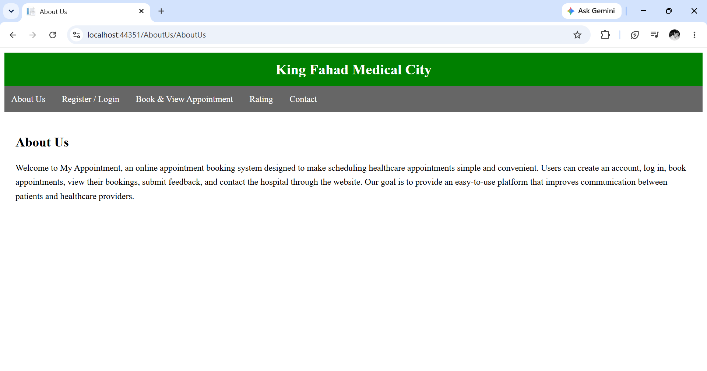
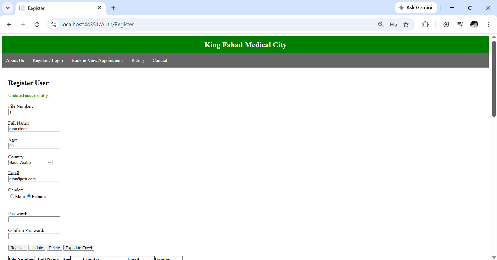
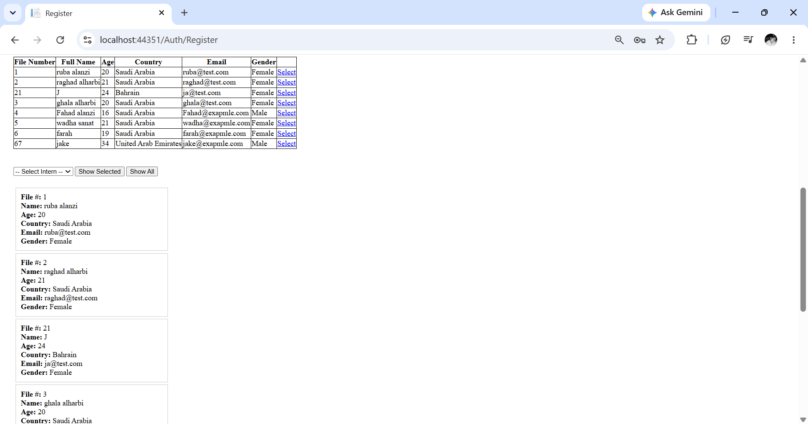
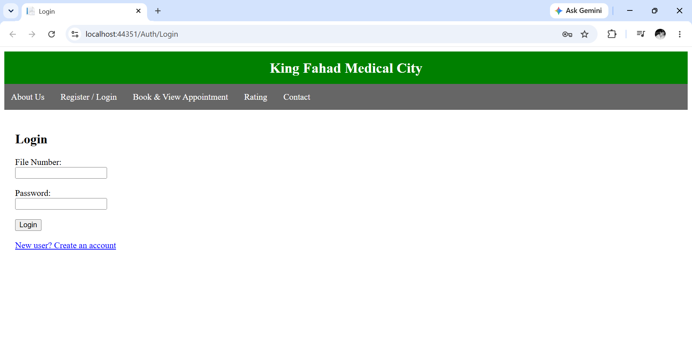
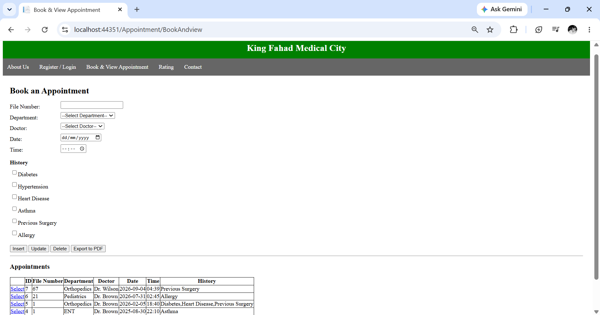
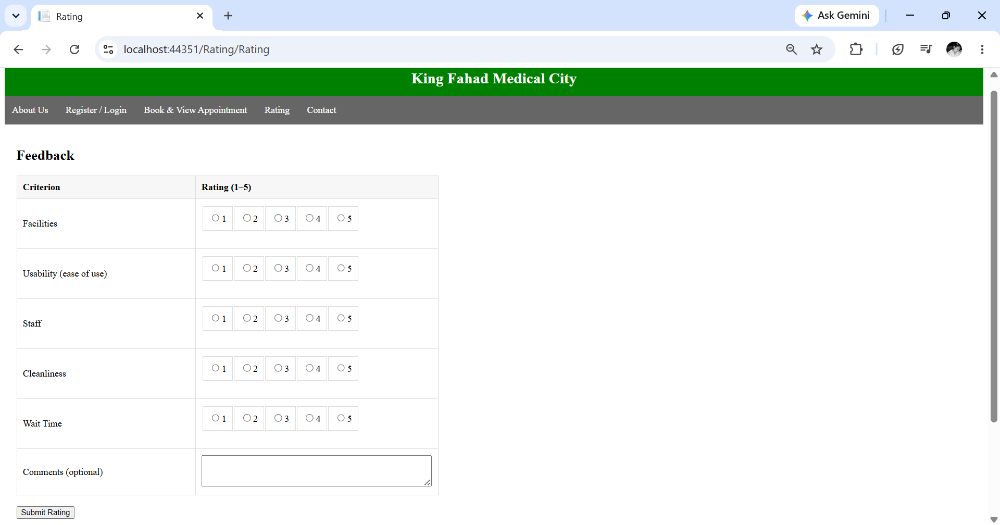
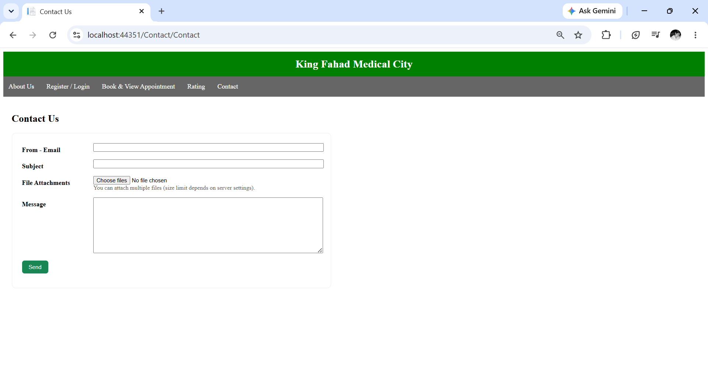

# MyAppointment

A web-based hospital appointment management system developed using ASP.NET Web Forms, C#, and SQL Server. The application allows users to register, log in, book appointments, view their appointments, contact the hospital, and submit service ratings.

## Features

- User Registration
- User Login
- Book Appointments
- View Booked Appointments
- Contact Hospital
- Submit Service Ratings
- About Us Page
- SQL Server Database Integration

## Technologies Used

- ASP.NET Web Forms
- C#
- SQL Server
- HTML5
- CSS3
- Bootstrap
- Visual Studio

## Database

The database script is included in the Database folder.

Before running the project:

1. Create a SQL Server database.
2. Run the SQL script located in:
     Database/MyAppointmentDB_Backup.sql
   3. Update the connection string in Web.config with your SQL Server instance.

Example:
Data Source=YOUR_SERVER;
Initial Catalog=MyAppointmentDB;
Integrated Security=True;

## Screenshots

### About Us

### Register (Part 1)

### Register (Part 2)

### Login

### Book Appointment

### Rating

### Contact

## Project Structure
MyAppointment
│
├── Appointment
├── Auth
├── Contact
├── Rating
├── AboutUs
├── Database
├── Screenshots
├── Web.config
└── README.md

## Author

Developed by Ruba Alanazi.